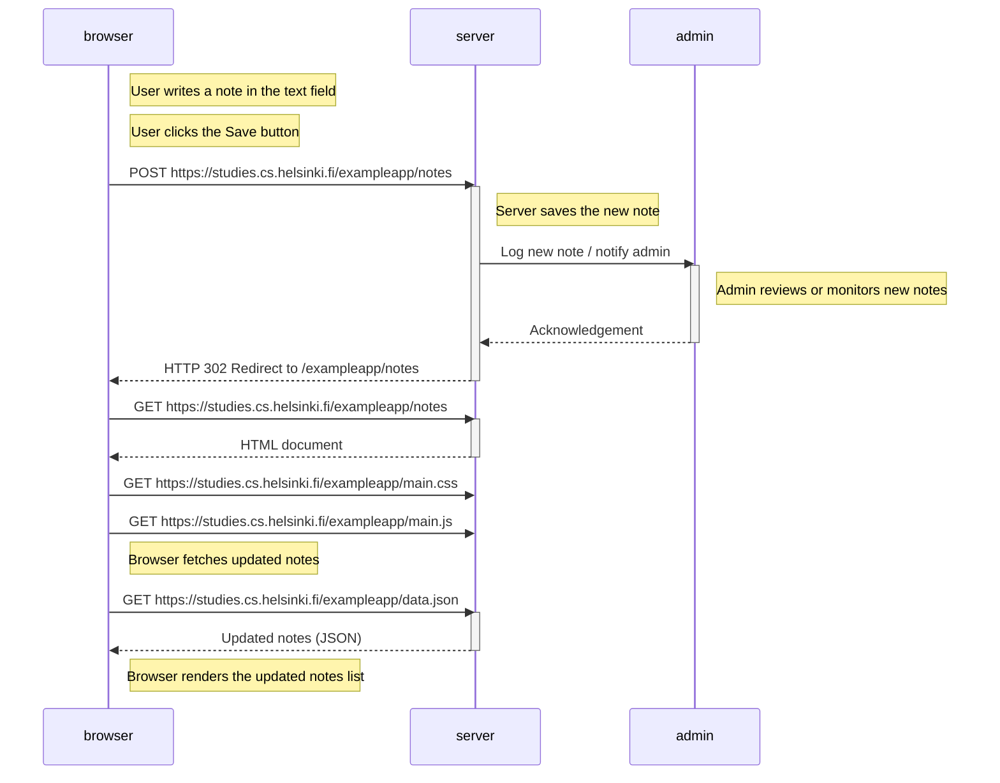

```mermaid
sequenceDiagram
    participant browser
    participant server
    participant admin

    Note right of browser: User writes a note in the text field
    Note right of browser: User clicks the Save button

    browser->>server: POST https://studies.cs.helsinki.fi/exampleapp/notes
    activate server
    Note right of server: Server saves the new note

    server->>admin: Log new note / notify admin
    activate admin
    Note right of admin: Admin reviews or monitors new notes
    admin-->>server: Acknowledgement
    deactivate admin

    server-->>browser: HTTP 302 Redirect to /exampleapp/notes
    deactivate server

    browser->>server: GET https://studies.cs.helsinki.fi/exampleapp/notes
    activate server
    server-->>browser: HTML document
    deactivate server

    browser->>server: GET https://studies.cs.helsinki.fi/exampleapp/main.css
    browser->>server: GET https://studies.cs.helsinki.fi/exampleapp/main.js

    Note right of browser: Browser fetches updated notes
    browser->>server: GET https://studies.cs.helsinki.fi/exampleapp/data.json
    activate server
    server-->>browser: Updated notes (JSON)
    deactivate server

    Note right of browser: Browser renders the updated notes list

```

